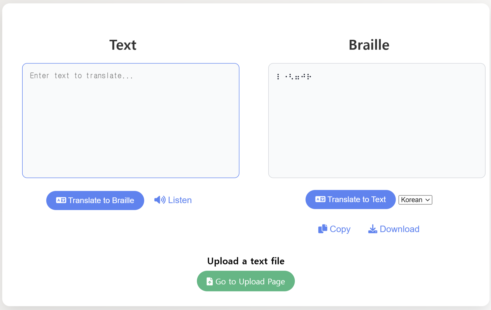
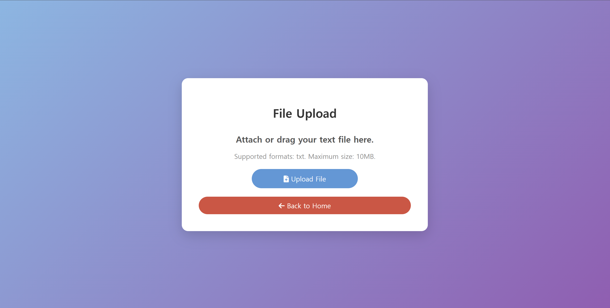

# python_team
python 팀플 과제

멤버:임예준, 이효진, 윤준식, 정세창, 최희진 (순서는 제맘입니다.)

**구현 기능: text -> 점자, 점자 -> text, txt파일 업로드 후 점자로 번역된 txt 다운로드, tts 기능, 한글기능** 

### 수정해야하는거
한글 ㅇ이 있을때 오류가 자주생김 이건 근데 한글 이슈라서 예외처리등 해야할듯 물론 ㅇ이없는 한글은 잘됨 ㅇㅇ 추후 수정 예정
한글이 코딩할땐 좋은언어는 아니여서 버그가 좀 많습니다. 최대한 수정해보는 중입니다.
<br>

### 이미지


현재 버전 기본인덱스 이미지 입니다.
<br><br><br>

/upload 사진입니다.


써보고 싶으시면 
```
git clone https://github.com/Burnnnnny/python_team.git
```
<br>

```
cd python_team
```

<br>

```
pip install -r requirements.txt
```

<br>

```
cd app
```

<br>

```
python3 app.py
```

도커파일,도커컴포즈도 추가 예정입니다.
써보시고 버그나 에러 등등 피드백 환영입니다. 추가 기능 넣고 싶으신거 있으시면 카톡 주세요