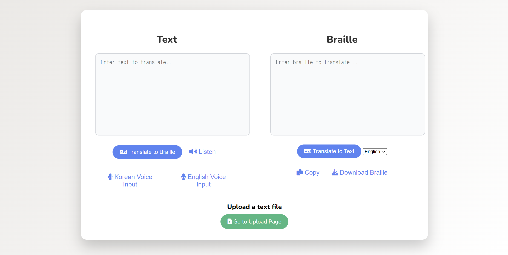
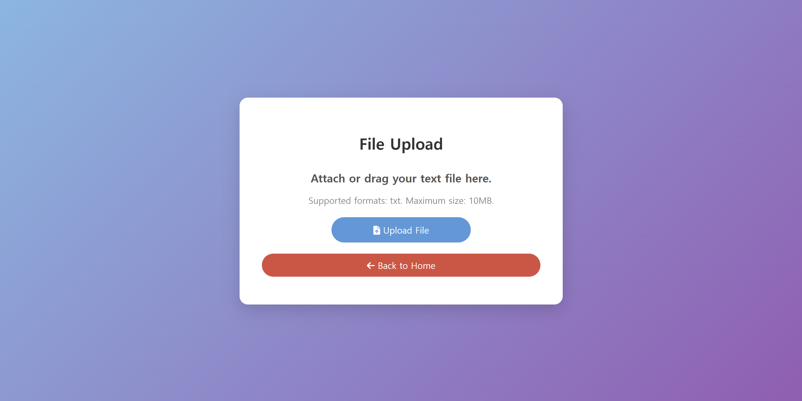
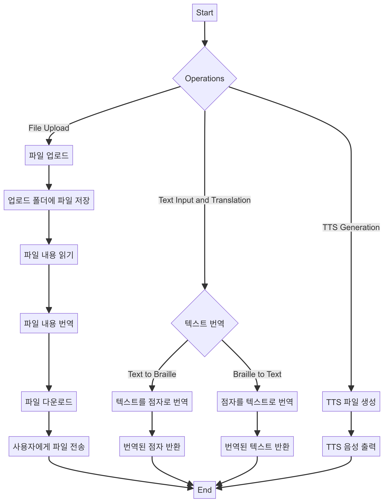
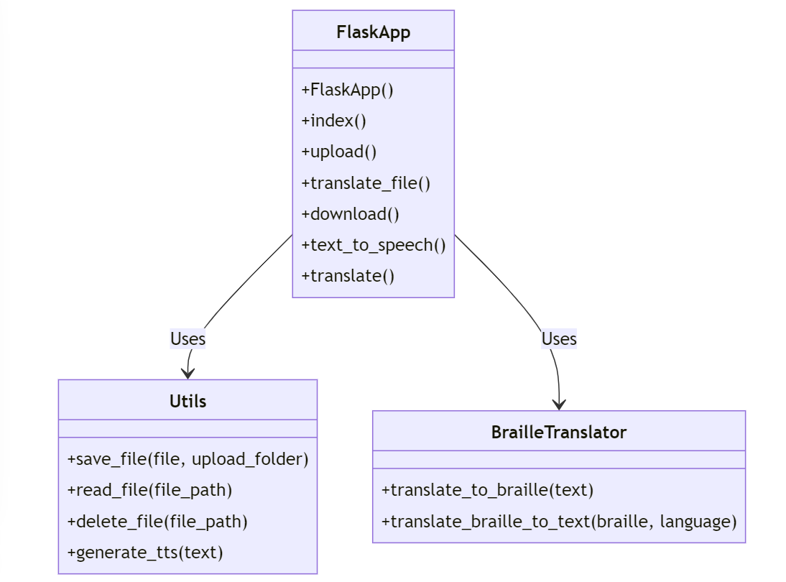

# python_team

### 파이썬프로그래밍(2024년 1학기 김창민 교수님) 팀플 과제


멤버:임예준(99.9%코드제작,다이어그램 제작), 이효진(ppt랑 발표), 윤준식(글자점자 매칭 코드 기여), 정세창(보고서 작성), 최희진(ppt제작)

참고로 Burnnnnny는 임예준입니다. 
도커도 넣었으니까 한번 써보세요.,

**구현 기능: text(영어,한글,숫자,문장부호) -> 점자, 점자(영어만) -> text,**
**txt파일 업로드 후 점자로 번역된 txt 다운로드, tts 기능, 음성입력기능** 

#### 참고사항
점자->숫자랑 한글기능은 기능 구현X, 완전히 정확하진 않음 
<br>

###  UI이미지

현재 버전 기본인덱스 이미지 입니다.


<br><br>
/upload 이미지입니다.

<br><br>

### 다이어그램
시스템 흐름도 입니다.

<br><br>

클래스 입니다.



#### 사용
써보고 싶으시면 

```
git clone https://github.com/Burnnnnny/python_team.git
cd python_team
pip install -r requirements.txt
cd app
python3 app.py
```

혹은 
```
git clone https://github.com/Burnnnnny/python_team.git
cd python_team
docker compose up
```
